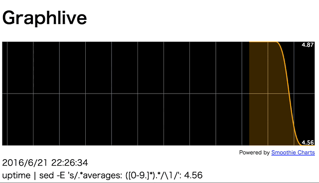
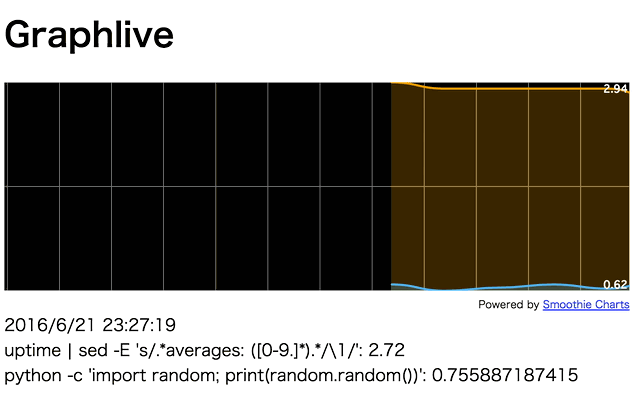

# graphlive
Visualize numeric results of one-liner in real time via browser.



## Installation

Download latest archive for your platform from [Releases](https://github.com/orangain/graphlive/releases) and unzip it.

Alternatively, you can use `go get`.

```
$ go get github.com/orangain/graphlive
```

## Usage

Specify a command which outputs numeric result to `-c` option.
The following example plots load averages.

```
$ graphlive -c "uptime | sed -E 's/.*averages: ([0-9.]*).*/\1/'"
```

Then navigate to `http://<host>:9999/` in browser.

You can provide multiple `-c` options.
The following example plots load averages and random numbers.

```
$ graphlive -c "uptime | sed -E 's/.*averages: ([0-9.]*).*/\1/'" -c "python -c 'import random; print(random.random())'"
```



### Full Usage

```
Usage:
    graphlive [options] -c COMMAND [-c COMMAND]...

Options:
    -p PORT, --port PORT
        Port to listen on (default: 9999)
    -h, --help
        Show this help message
    -r WEBROOT, --webroot WEBROOT
        Root directory of web server (default: embedded resources)
```

`-r, --webroot` is an advanced option. You can override web resources completely by downloading the `webroot` directory and modify it.

## Acknowledgement

## License

MIT License. See `LICENSE`.
